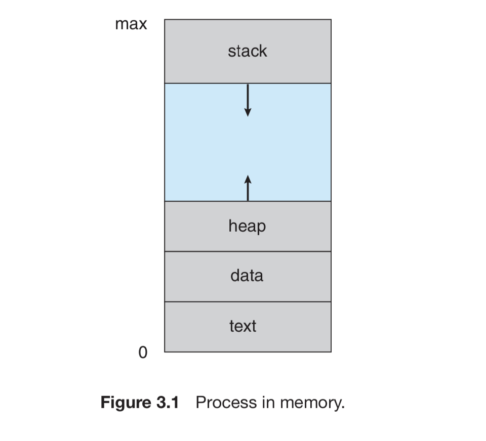
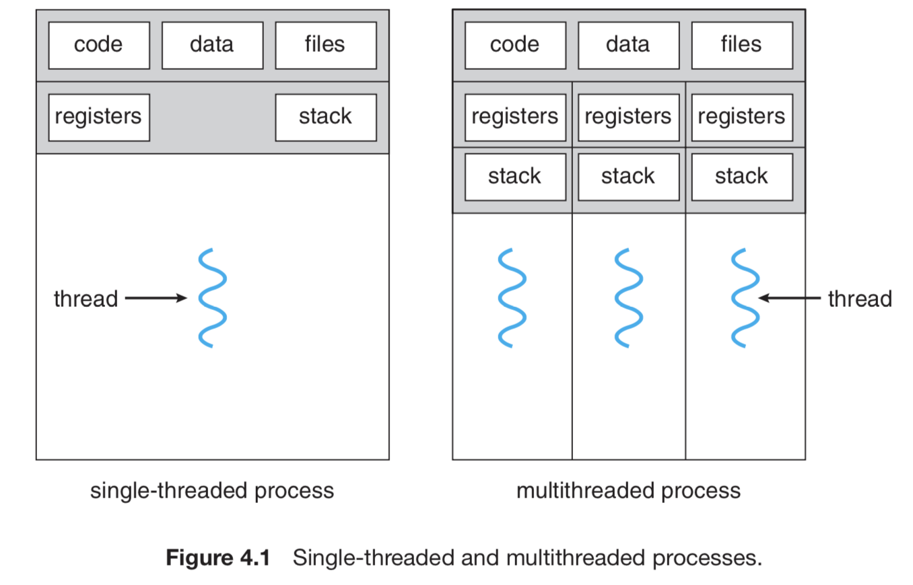

# OS

* Process
  * PCB - process control block
  * Process state: new, ready, running, waiting, terminated
  * program counter: address of next instruction
  * Registers
  * Memory:
    * Stack **- function parameters, local variables, return addresses**
    * Data - **global variables \(static\)**
    * Heap - **dynamic memory \(global too\)**
    * Text - code

* Threads 
  * Its own program counter, register set, and stack.
  * Shares heap, data, text with rest of threads belonging to same process.

* Scheduling 
  * Long-term: selects processes from job pool \(disk\) to ready queue \(memory\) for execution
* Context switching
  * 
* Mutex
* Semaphore
* Physical vs logical memory
*   

